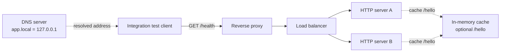

# Infra from Scratch

[](https://github.com/max-vie/infra-from-scratch/actions/workflows/tests.yml)

A systems design project that builds a small networked service stack from
scratch.

The components use raw sockets, manual protocol parsing, language standard
libraries, and POSIX interfaces. The code exposes process and protocol
boundaries.

## Working system

The integration suite starts a DNS server, reverse proxy, load balancer, and
two HTTP servers. Its client resolves `app.local` and sends an HTTP request
through the complete path:



The custom HTTP client drives the integrated request path. The HTTP servers can
optionally use the in-memory cache for `GET /hello`; the cache also remains a
standalone component with its own tests.

## Components

| Component | Language | State | Focus |
| --- | --- | --- | --- |
| [HTTP client and server](http-server/) | Python | Working | URL parsing, HTTP messages, sockets, and application routing |
| [DNS server](dns-server/) | Go | Working | UDP, binary message parsing, and DNS records |
| [Reverse proxy](reverse-proxy/) | Go | Working | Concurrent clients, request forwarding, and gateway failures |
| [Load balancer](load-balancer/) | Go | Working | Round-robin selection and backend failover |
| [In-memory cache](in-mem-cache/) | C | Working, optional | TCP text protocol, bounded storage, lazy expiry, and HTTP `/hello` caching |
| Container runtime | C | Planned | Linux process and filesystem isolation |

Each component owns its source, tests, documentation, and architecture
decisions. Cross-component decisions live in [`docs/`](docs/).

## Run the integrated path

You need Python 3, Go, and GCC. No package installation is required.

```bash
git clone https://github.com/max-vie/infra-from-scratch.git
cd infra-from-scratch
python -m unittest discover -s integration-tests -v
```

The test compiles and starts every service on temporary local ports, sends
requests through the stack, and shuts the processes down afterward.

GCC with C11 support is also required to build and test the in-memory cache.
See the component READMEs for individual run commands and supported behavior.

## Validate the repository

Run the socket-based suites sequentially:

```bash
python -m unittest discover -s http-server/tests -v
python -m unittest discover -s reverse-proxy/tests -v
python -m unittest discover -s load-balancer/tests -v
python -m unittest discover -s in-mem-cache/tests -v
python -m py_compile http-server/server.py http-server/client.py
(cd dns-server && go test server.go server_test.go)
python -m unittest discover -s integration-tests -v
```

The same checks run in GitHub Actions for pull requests and pushes to `main`.

## Boundaries

This is a learning project with deliberately small interfaces. The HTTP path
does not support TLS, request bodies, persistent connections, or chunked
transfer encoding. The DNS server owns one local record, the load balancer has
two fixed backends, and the cache has no persistence or authentication. The
HTTP cache path only covers the deterministic `/hello` response and fails open
when the optional cache cannot be reached.

Possible next steps include building the container runtime and exploring
service discovery and observability.

## Feedback and license

Focused issues and pull requests are welcome. Read
[`CONTRIBUTING.md`](CONTRIBUTING.md) before proposing a larger change.

The project is available under the [MIT License](LICENSE).
